<picture>
  <source media="(prefers-color-scheme: dark) and (prefers-reduced-motion: reduce)" srcset="assets/banner-dark-static.svg">
  <source media="(prefers-color-scheme: light) and (prefers-reduced-motion: reduce)" srcset="assets/banner-light-static.svg">
  <source media="(prefers-color-scheme: dark)" srcset="assets/banner-dark.svg">
  
</picture>

AI Engineer. Currently building [Senda](https://trysenda.xyz) on my free time, the agents' software factory, and working at [Persiscal](https://persiscal.com/)

Full descriptions at [matiaslapolla.com](https://matiaslapolla.com).

### Articles

[All articles →](https://matiaslapolla.com/blog)

### Get in touch

- [hi@matiaslapolla.com](mailto:hi@matiaslapolla.com)
- [matias@trysenda.xyz](mailto:matias@trysenda.xyz)
- [matiaslapolla.com](https://matiaslapolla.com)
- [CV](https://matiaslapolla.com/cv)

The banner is generated from matiaslapolla.com's own fonts and colour tokens — see <a href="scripts/gen_banner.py">scripts/gen_banner.py</a>.
